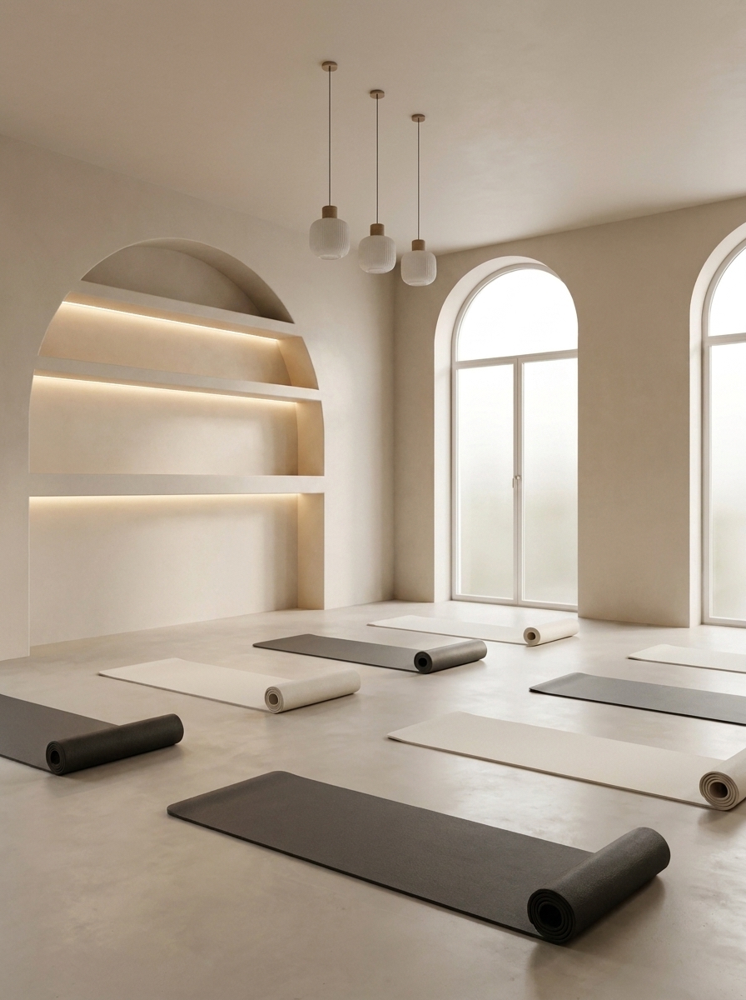

<div align="center">

# The Lab Pilates Studio

### Landing Page — Sitio Web Oficial

**Un espacio donde la ciencia del movimiento se encuentra con el arte del bienestar.**

[](https://nextjs.org/)
[](https://react.dev/)
[](https://www.typescriptlang.org/)
[](https://tailwindcss.com/)
[](https://vitest.dev/)

[](#)
[](#)

---



</div>

---

## Sobre el Proyecto

**The Lab Pilates Studio** es una landing page de pre-lanzamiento para un estudio de Pilates, Barre y Yoga ubicado en **Huajuapan de León, Oaxaca, México**. El sitio presenta la filosofía del estudio, los tipos de clases disponibles, paquetes de precios, horarios interactivos y un formulario de lista de espera para la apertura programada en **Agosto 2026**.

El dominio oficial es **[thelabpilates.com](https://thelabpilates.com)**.

---

## Stack Tecnológico

<div align="center">

| Tecnología | Versión | Propósito |
|:---:|:---:|:---|
|  | 16.2.11 | Framework de React con App Router, SSR y optimización de imágenes |
|  | 19.2.4 | Librería de interfaces con Server Components por defecto |
|  | 5.x | Tipado estático estricto para mayor seguridad y mantenibilidad |
|  | 4.x | Framework CSS utility-first con sistema de diseño personalizado |
|  | 4.1.10 | Framework de testing rápido con soporte nativo para ESM |
|  | 9.x | Linting con reglas de Core Web Vitals y TypeScript |
|  | — | Procesador CSS con plugin de Tailwind |

</div>

---

## Características

- **Diseño Responsive** — Se adapta perfectamente a desktop, tablet y móvil
- **Animaciones Suaves** — Scroll reveal, parallax en el hero, y transiciones de vista
- **Componentes Server** — Componentes de React renderizados en servidor para mejor performance
- **Interactividad en el Cliente** — Navbar con scroll-aware styling, horario con selector de días, botones dinámicos
- **Sistema de Diseño "Kinetic Sanctuary"** — Tokens de color, tipografía y espaciado personalizados
- **Testing Unitario** — Suite de tests con Vitest y Testing Library
- **SEO Optimizado** — Metadata completa, Open Graph, canonical URLs, y robots config
- **Accesibilidad** — ARIA labels, contraste de colores, estructura semántica

---

## Estructura del Proyecto

```
src/
├── app/
│   ├── globals.css          # Sistema de diseño "Kinetic Sanctuary"
│   ├── layout.tsx           # Layout raíz (fonts, metadata, SEO)
│   ├── page.tsx             # Landing page principal
│   └── soon/
│       └── page.tsx         # Página "Próximamente"
├── components/
│   ├── layout/
│   │   ├── Navbar.tsx       # Navegación fija con scroll-aware styling
│   │   └── Footer.tsx       # Pie de página con redes sociales
│   ├── sections/
│   │   ├── Hero.tsx         # Hero con parallax y CTAs
│   │   ├── Philosophy.tsx   # Sección filosofía del estudio
│   │   ├── MatPilatesInfo.tsx  # Información sobre Mat Pilates
│   │   ├── Barre.tsx        # Información sobre Barre
│   │   ├── HathaYoga.tsx    # Información sobre Hatha Yoga
│   │   ├── Pricing.tsx      # Paquetes y precios
│   │   ├── Schedule.tsx     # Horario interactivo
│   │   └── Location.tsx     # Ubicación y formulario de espera
│   └── ui/
│       ├── Button.tsx       # Componente Button reutilizable
│       └── Button.test.tsx  # Tests unitarios del Button
└── lib/
    └── fonts.ts             # Configuración de fuentes Google
```

---

## Inicio Rápido

### Prerrequisitos

- [Node.js](https://nodejs.org/) 18+ (recomendado: 20 LTS)
- npm, yarn o pnpm

### Instalación

```bash
# Clonar el repositorio
git clone https://github.com/thelabpilates/frontend.git
cd frontend

# Instalar dependencias
npm install
```

### Desarrollo

```bash
npm run dev
```

Abre [http://localhost:3000](http://localhost:3000) en tu navegador para ver el resultado.

### Scripts Disponibles

| Comando | Descripción |
|:---|:---|
| `npm run dev` | Inicia el servidor de desarrollo con hot reload |
| `npm run build` | Genera una build de producción optimizada |
| `npm run start` | Inicia el servidor de producción |
| `npm run lint` | Ejecuta ESLint para verificar código |

---

## Sistema de Diseño "Kinetic Sanctuary"

El proyecto utiliza un sistema de diseño personalizado definido en `globals.css` con tokens de Tailwind CSS v4:

### Paleta de Colores

| Token | Color | Uso |
|:---|:---:|:---|
| `--color-background` | `#fcf9f8` | Fondo principal |
| `--color-soft-charcoal` | `#2A2A2A` | Texto principal |
| `--color-warm-wood` | `#BD9B7D` | Acentos premium |
| `--color-primary` | `#685d4e` | Elementos primarios |
| `--color-secondary` | `#6f5b44` | Elementos secundarios |
| `--color-surface-cream` | `#F9F8F6` | Superficies |
| `--color-on-surface` | `#1b1c1c` | Texto sobre superficies |

### Tipografía

| Fuente | Uso | Pesos |
|:---|:---|:---|
| **Playfair Display** | Títulos y headlines | 500, 600 |
| **Inter** | Texto de cuerpo | 400, 600 |
| **Material Symbols** | Iconos | — |

---

## Testing

El proyecto incluye tests unitarios con **Vitest** y **Testing Library**:

```bash
# Ejecutar todos los tests
npx vitest run

# Ejecutar tests en modo watch
npx vitest

# Ejecutar con coverage
npx vitest run --coverage
```

Actualmente existen **16 tests** para el componente `Button`, cubriendo:
- Renderizado de elementos (button vs anchor)
- Variantes visuales (primary, secondary, outline)
- Tamaños (sm, md, lg)
- Accesibilidad (aria-label, focus-visible)
- Interactividad (onClick handlers)

---

## Rutas Disponibles

| Ruta | Descripción |
|:---|:---|
| `/` | Landing page principal con todas las secciones |
| `/soon` | Página de "Próximamente" — placeholder para el sistema de reservaciones |

---

## Notas para el Desarrollador

### Comportamiento de Componentes

- **Server Components por defecto**: Solo los componentes que requieren interactividad (`'use client'`) están marcados como tales: `Navbar`, `Hero`, `Schedule`, `Button`.
- **View Transitions**: Habilitado experimentalmente en `next.config.ts` para animaciones de transición entre páginas.
- **Parallax Effect**: El hero utiliza `transform: translateY()` basado en scroll position para crear un efecto parallax.
- **Scroll-aware Navbar**: La navbar cambia de transparente a blanca con sombra al hacer scroll.

### Configuración de Imágenes

- Calidades permitidas: `75` y `90` (configurado en `next.config.ts`)
- Imágenes locales en `public/images/`
- Imágenes remotas desde Google (`lh3.googleusercontent.com`) — requieren configuración de `remotePatterns` si se agregan más

### Variables de Ruta

- Los componentes usan rutas relativas (`/soon`) para CTAs del sistema de reservaciones pendiente
- Los enlaces de redes sociales en el Footer son placeholders (`#`)

### Extensión del Sistema de Diseño

Los tokens están definidos en `globals.css` bajo `@theme`. Para agregar nuevos tokens:

```css
@theme {
  --color-mi-color: #hex;
  --spacing-mi-espacio: 16px;
}
```

Estos tokens se usan con las utilidades de Tailwind: `bg-mi-color`, `p-mi-espacio`, etc.

---

## Paquetes de Precios

| Paquete | Sesiones | Precio (MXN) | Por Sesión |
|:---|:---:|---:|---:|
| **Lab Pass** | 1 | $120 | $120 |
| **Lab Entry** | 4 | $460 | $115 |
| **Lab Practice** | 8 | $880 | $110 |
| **Lab Progress** | 12 | $1,260 | $105 |
| **Open Lab** | Ilimitado | $2,850 | — |

---

## Horario de Clases

| Clase | Horario | Instructor |
|:---|:---:|:---|
| **Lab Flow** | 7:00 – 8:00 AM | Ana G. |
| **Foundation** | 9:30 – 10:30 AM | Carlos R. |
| **Core Lab** | 6:00 – 7:00 PM | Elena M. |

---

## Despliegue

### Vercel (Recomendado)

El proyecto está optimizado para desplegue en Vercel:

[](https://vercel.com/new/clone?repository-url=https://github.com/thelabpilates/frontend)

### Build de Producción

```bash
npm run build
npm run start
```

---

## Licencia

Este es un proyecto privado. Todos los derechos reservados.

---

<div align="center">

**The Lab Pilates Studio** — Huajuapan de León, Oaxaca, México

Made with care for movement and well-being.

</div>
