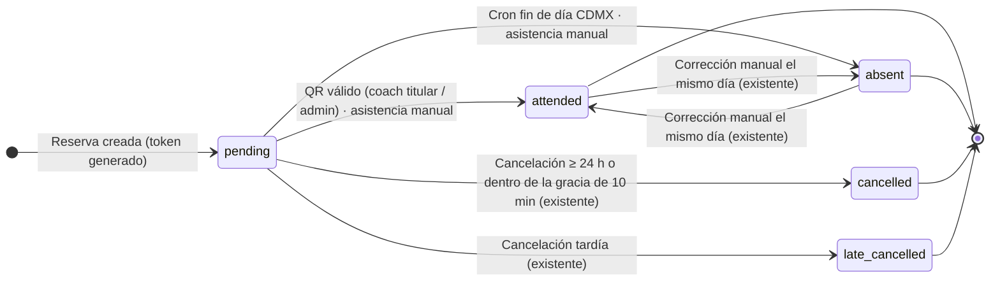

# SPEC-QR-CHECKIN — Asistencia a clases mediante código QR

**Estado:** ✅ Aprobado e implementado (2026-09-23). Falta la ejecución en producción (§12, la hace el usuario).
**Fecha:** 2026-09-22 · **Zona horaria oficial:** `America/Mexico_City` (UTC-6 fijo, sin horario de verano)
**Plan TDD:** [`TASK_RUNNER.md`](TASK_RUNNER.md) → sección `TASK-QR-CHECKIN`

---

## 1. Objetivo y alcance

El cliente muestra un QR en su dashboard. Un coach (titular de la clase) o un admin lo escanea con el celular y la reserva pasa de `pending` a `attended` en una sola transacción. Las reservas que siguen en `pending` cuando termina el día CDMX de la clase pasan a `absent`.

- **El enum `enrollment_status` no cambia** (`pending | attended | absent | late_cancelled | cancelled`).
- **No se ejecutan comandos de Drizzle contra la BD viva.** Todo cambio de esquema es SQL manual, aditivo e idempotente (§3).
- **Fuera de alcance:** invitados (`guest_enrollments`), registros de eventos (`special_event_registrations`), escáner dentro de la app, notificaciones push/realtime y la limpieza del token en los flujos de cancelación existentes (el token queda inerte; ver I-2).

---

## 2. Decisiones

Confirmadas por el usuario el 2026-09-23. D6 y D7 se implementaron con la recomendación, sin objeciones.

| ID | Tema | Recomendación original | Alternativa | Tareas |
|---|---|---|---|---|
| D1 | Respuesta de `/check-in` a un `client` | `forbidden()` → HTTP 403 real. Requiere `experimental.authInterrupts: true` (API marcada *experimental* en Next 16) | **✅ Elegida:** vista 403 inline (HTTP 200); la API sí responde 403. El usuario pidió activar `authInterrupts` solo si era estable, y no lo es | FE-01 |
| D2 | Coach que **no** es titular de la clase | 403 `NOT_CLASS_COACH`, la misma regla que `updateAttendanceAction` | Cualquier coach puede registrar | BE-04 |
| D3 | Clase en curso en "Tu próxima clase" | La clase se muestra hasta que termina (`class_date + 50 min`), así quien llega tarde puede mostrar su QR | Mantener `class_date > now` (el QR desaparece al iniciar la clase) | FE-03 |
| D4 | ⚠️ **Bloqueante.** Reservas `pending` de clases pasadas que nunca se marcaron | El cierre automático solo aplica a clases desde la fecha de salida a producción (`ATTENDANCE_AUTO_CLOSE_FROM`); el historial no se toca | Cerrar también todo el historial, lo que reescribe datos reales. Revisar antes el conteo B de §8.1 | BE-07, DB-03 |
| D5 | Librería QR | `qrcode`: SVG generado en el servidor como data URL, sin peso extra en el bundle del cliente | `react-qr-code` (se renderiza en el cliente) | DEP-01, BE-01 |
| D6 | Momento de generar el token | Al reservar (`enrollment.ts`, `guest.ts`), más backfill y fallback en el dashboard | Solo backfill + fallback (lazy) | BE-03 |
| D7 | Ventana de check-in | El día calendario CDMX de la clase: reusa `isAttendanceWindowOpen`, igual que la asistencia manual. Fuera de ella → 409 | Sin ventana | BE-04 |

---

## 3. Base de datos

### 3.1 Estado actual confirmado — `public.class_enrolleds`

Drizzle: `classEnrollments` en `src/db/schema.ts`.

| Columna | Tipo | Notas |
|---|---|---|
| `id` | `uuid` | PK, `gen_random_uuid()` |
| `open_class_id` | `uuid` | FK → `open_class(id)` |
| `user_suscription_id` | `uuid` | FK → `user_suscriptions(id)` |
| `status` | `enrollment_status` | default `'pending'` |
| `created_at` | `timestamptz` | default `now()` |

Índice único existente: `uk_class_user_enrollment (open_class_id, user_suscription_id)`.

### 3.2 DDL — `sql/manual/2026-09-22_001_qr_checkin_columns.sql`

```sql
-- Feature: Asistencia por QR (SPEC-QR-CHECKIN §3.2)
-- Aditivo e idempotente: re-ejecutarlo no cambia nada. No toca datos existentes.
-- Ejecutar: psql "$DATABASE_URL_DIRECT" -v ON_ERROR_STOP=1 -f sql/manual/2026-09-22_001_qr_checkin_columns.sql
BEGIN;
SET LOCAL lock_timeout = '5s';        -- si la tabla está ocupada, aborta en vez de encolar tráfico real
SET LOCAL statement_timeout = '60s';

ALTER TABLE public.class_enrolleds
  ADD COLUMN IF NOT EXISTS checkin_token varchar(64);

ALTER TABLE public.class_enrolleds
  ADD COLUMN IF NOT EXISTS checked_in_at timestamptz;

DO $$
BEGIN
  IF NOT EXISTS (
    SELECT 1
    FROM pg_constraint
    WHERE conname = 'class_enrolleds_checkin_token_unique'
      AND conrelid = 'public.class_enrolleds'::regclass
  ) THEN
    ALTER TABLE public.class_enrolleds
      ADD CONSTRAINT class_enrolleds_checkin_token_unique UNIQUE (checkin_token);
  END IF;
END
$$;

COMMENT ON COLUMN public.class_enrolleds.checkin_token IS
  'Token QR de un solo uso (64 hex). Válido solo con status = pending; NULL tras attended/absent.';
COMMENT ON COLUMN public.class_enrolleds.checked_in_at IS
  'Momento del check-in (QR o asistencia manual) cuando status pasa a attended.';

COMMIT;
```

- Un `ADD COLUMN` nullable y sin default solo cambia metadatos en PG ≥ 11: no reescribe la tabla y el bloqueo dura milisegundos.
- `UNIQUE` crea un índice. Postgres admite múltiples `NULL`, así que las filas sin token no chocan.
- El nombre del constraint coincide con la convención de Drizzle (`<tabla>_<columna>_unique`).

### 3.3 Verificación post-DDL (solo lectura)

```sql
SELECT column_name, data_type, character_maximum_length, is_nullable
FROM information_schema.columns
WHERE table_schema = 'public' AND table_name = 'class_enrolleds'
  AND column_name IN ('checkin_token', 'checked_in_at');
-- Esperado: checkin_token | character varying        | 64   | YES
--           checked_in_at | timestamp with time zone | NULL | YES

SELECT conname FROM pg_constraint
WHERE conrelid = 'public.class_enrolleds'::regclass
  AND conname = 'class_enrolleds_checkin_token_unique';
-- Esperado: 1 fila

SELECT enum_range(NULL::public.enrollment_status);
-- Esperado: {pending,attended,absent,late_cancelled,cancelled} (sin cambios)
```

### 3.4 Schema Drizzle — `src/db/schema.ts`

```ts
export const classEnrollments = pgTable(
  'class_enrolleds',
  {
    // … columnas existentes sin cambios (id, openClassId, userSubscriptionId, status, createdAt)
    // QR check-in — aplicado con SQL manual: sql/manual/2026-09-22_001_qr_checkin_columns.sql
    checkinToken: varchar('checkin_token', { length: 64 }).unique('class_enrolleds_checkin_token_unique'),
    checkedInAt: timestamp('checked_in_at', { withTimezone: true }),
  },
  (table) => ({
    uniqueEnrollment: uniqueIndex('uk_class_user_enrollment').on(
      table.openClassId,
      table.userSubscriptionId
    ),
  })
);
```

Tipos inferidos: `checkinToken: string | null`, `checkedInAt: Date | null`.

### 3.5 Reglas de migración (obligatorias)

1. **Prohibido:** `drizzle-kit push` (con o sin `--force`), `pnpm db:push`, `pnpm db:migrate`, `DROP`, `TRUNCATE`, `DELETE`, `ALTER TYPE`, `RENAME`, `SET NOT NULL`.
2. **No se corre `pnpm db:generate` para este cambio.** El snapshot de `drizzle/meta` queda desalineado a propósito, porque la BD viva no usa Drizzle Migrations.
3. Los scripts viven en `sql/manual/` (fuera de `drizzle/`) y **los ejecuta el usuario** (Supabase SQL Editor o `psql` con `DATABASE_URL_DIRECT`).
4. **Orden obligatorio: primero el DDL en producción, después el deploy del código.** Drizzle incluye todas las columnas del schema en `db.query.*` y en `select()` sin proyección. Si el código sale antes que el DDL, falla con `column "checkin_token" does not exist`. El DDL, en cambio, es compatible con el código actual: son columnas nullable que nadie lee.

---

## 4. Token de check-in

| Propiedad | Valor |
|---|---|
| Formato | 64 caracteres hex en minúsculas: `^[0-9a-f]{64}$` |
| Generación en app | `crypto.randomBytes(32).toString('hex')` (256 bits) |
| Generación en backfill | Dos `gen_random_uuid()` sin guiones, concatenados (244 bits). Solo usa el core de PG ≥ 13, sin `pgcrypto` |
| Cuándo se crea | Al reservar (D6), en el backfill de reservas futuras (§8) y como fallback al cargar el dashboard (§10.1) |
| Vida útil | Un solo uso. Pasa a `NULL` cuando la reserva pasa a `attended` o `absent` |
| URL del QR | `${NEXT_PUBLIC_APP_URL sin "/" final}/check-in?token=<token>` |
| Contenido del QR | Solo la URL, sin datos personales |

Módulos en `src/lib/checkin/`:

- `token.ts`: `generateCheckinToken`, `isValidCheckinToken`, `buildCheckinUrl`.
- `qr.ts`: `buildCheckinQrDataUrl`.
- `ensure-token.ts`: `ensureCheckinToken`.
- `constants.ts`: regex del token, intervalos de polling y `ATTENDANCE_AUTO_CLOSE_FROM`.
- `errors.ts`: códigos, mapeo a HTTP y mensajes. Debe ser seguro para el cliente (sin imports de servidor).

**`ensureCheckinToken(enrollmentId)`** hace un solo `UPDATE … SET checkin_token = $nuevo WHERE id = $id AND status = 'pending' AND checkin_token IS NULL RETURNING checkin_token`.

- Si no actualiza ninguna fila (otra petición lo generó primero), relee y devuelve el token existente.
- Si la reserva ya no está `pending`, devuelve `null`.
- Ante un error `23505` (colisión del unique) reintenta una vez.

---

## 5. Máquina de estados — `class_enrolleds.status`



| Desde → Hacia | Disparador | Actor | `checkin_token` | `checked_in_at` |
|---|---|---|---|---|
| ∅ → `pending` | Reserva (`enrollment.ts`, `guest.ts`) | client | generado | `NULL` |
| `pending` → `attended` | `POST /api/check-in` | coach titular / admin | `NULL` | `now()` |
| `pending` → `attended` | `updateAttendanceAction` | coach titular / admin | `NULL` | `now()` |
| `pending` → `absent` | Cron (fin del día CDMX) | sistema | `NULL` | `NULL` |
| `pending` → `absent` | `updateAttendanceAction` | coach titular / admin | `NULL` | `NULL` |
| `attended` ↔ `absent` | `updateAttendanceAction` (mismo día CDMX) | coach titular / admin | `NULL` | `now()` / `NULL` |
| `pending` → `cancelled` / `late_cancelled` | Flujos de cancelación existentes (sin cambios) | client / admin | se conserva, pero es inerte (I-1) | `NULL` |

---

## 6. Invariantes

- **I-1** Un token solo se acepta si la reserva está en `pending`. Se valida dentro de la transacción, con la fila bloqueada.
- **I-2** Toda transición a `attended` o `absent` pone `checkin_token = NULL`. En `cancelled` y `late_cancelled` el token puede quedarse, pero es inerte por I-1 y no se muestra, porque el dashboard solo muestra reservas `pending`.
- **I-3** `checked_in_at` se escribe solo al pasar a `attended` (por QR o manualmente) y se limpia al corregir a `absent`. Las filas `attended` históricas se quedan con `NULL`.
- **I-4** Ninguna transición de este feature mueve créditos ni cupos. El crédito ya se consumió al reservar.
- **I-5** Solo el coach titular de la clase o un admin pueden pasar una reserva a `attended` (D2). Se valida en el backend; la UI no es la barrera.
- **I-6** El check-in solo procede durante el día calendario CDMX de la clase (D7).
- **I-7** El enum `enrollment_status` no cambia.

---

## 7. Contratos HTTP

Formato común de error:

```json
{ "ok": false, "error": { "code": "TOKEN_NOT_FOUND", "message": "Código QR inválido o ya utilizado", "details": {} } }
```

Todas las respuestas de `/api/check-in*` llevan `Cache-Control: no-store`.

### 7.1 `GET /check-in?token=<token>` — página (Server Component)

Archivo: `src/app/check-in/page.tsx`. Está fuera de `(portal)`: el `matcher` del middleware no la cubre y la página hace su propia autorización.

| Condición | Respuesta |
|---|---|
| Sin sesión o JWT inválido | `307` → `/login?redirect=%2Fcheck-in%3Ftoken%3D<token>` (`redirect()`) |
| Rol `client` | Vista "403 · Acceso denegado" inline (HTTP 200, D1). No llama a la API |
| `coach`/`admin` con token ausente, mal formado o repetido (arreglo) | `200` con "Código QR inválido o ya utilizado", sin llamar a la API |
| `coach`/`admin` con token de formato válido | `200`. `<CheckInProcessor>` hace un único `POST /api/check-in` al montarse y muestra el resultado |

- Metadata: `robots: { index: false }`.
- En Next 16, `searchParams` es una `Promise` y hay que usar `await`.
- **Por qué POST desde el cliente:** un GET no muta estado, así que un prefetch, una vista previa del enlace o una recarga no registran asistencia. Como el token no es reusable, un reintento devuelve 404 sin efectos.

### 7.2 `POST /api/check-in` — registrar asistencia

Archivos: `src/app/api/check-in/route.ts`, que llama al servicio `processCheckin()` en `src/lib/checkin/process-checkin.ts`.

```http
POST /api/check-in
Content-Type: application/json
Cookie: session=<JWT>        # httpOnly, SameSite=Lax

{ "token": "<64 hex>" }
```

**Orden de validación (cada paso corta la ejecución):**

1. `Origin` presente con un host distinto al de la petición → 403 `INVALID_ORIGIN`.
2. Sin sesión → 401 `UNAUTHENTICATED`.
3. Rol `client` → 403 `FORBIDDEN_ROLE`. Se evalúa antes de leer el body, así que un cliente nunca llega a la BD.
4. Body que no es JSON, o `token` que no es string → 400 `INVALID_PAYLOAD`.
5. `token` que no cumple `^[0-9a-f]{64}$` → 404 `TOKEN_NOT_FOUND`, sin consultar la BD.
6. Transacción (§7.2.1).

**Respuesta 200:**

```json
{
  "ok": true,
  "data": {
    "enrollmentId": "8b9c…",
    "studentName": "Ana",
    "className": "Mat Pilates",
    "classDate": "2026-09-22T15:00:00.000Z",
    "checkedInAt": "2026-09-22T14:56:10.123Z"
  }
}
```

| HTTP | `code` | Cuándo | Mensaje en pantalla |
|---|---|---|---|
| 400 | `INVALID_PAYLOAD` | Body inválido | Código QR inválido o ya utilizado |
| 401 | `UNAUTHENTICATED` | Sin sesión o JWT vencido | Tu sesión expiró. Inicia sesión de nuevo. (+ enlace a login con `redirect`) |
| 403 | `FORBIDDEN_ROLE` | Rol `client` | Solo coaches y administradores pueden registrar asistencia. |
| 403 | `NOT_CLASS_COACH` | Coach que no es titular (D2) | Esta reserva es de una clase de otro coach. |
| 403 | `INVALID_ORIGIN` | `Origin` de otro sitio | Solicitud no permitida. |
| 404 | `TOKEN_NOT_FOUND` | Token mal formado, inexistente o ya usado. Tras usarse queda en `NULL`, así que los tres casos son indistinguibles a propósito | Código QR inválido o ya utilizado |
| 409 | `ENROLLMENT_NOT_PENDING` | El token existe pero `status ≠ pending` (`details.status`) | Esta reserva ya no está pendiente. |
| 409 | `CLASS_CANCELLED` | `open_class.status = 'cancelled'` | La clase de esta reserva fue cancelada. |
| 409 | `OUTSIDE_ATTENDANCE_WINDOW` | Hoy (CDMX) no es el día de la clase (`details.classDate`) | Este código es para la clase del {fecha}. |
| 500 | `INTERNAL_ERROR` | Excepción no controlada (la respuesta no incluye el stack) | No pudimos registrar la asistencia. Intenta de nuevo. |

#### 7.2.1 Transacción atómica

```text
BEGIN
  SELECT ce.id, ce.status, oc.id, oc.class_date, oc.status, oc.coach_user_id,
         oc.class_type, oc.custom_name, u.username
  FROM class_enrolleds ce
  JOIN open_class oc        ON oc.id = ce.open_class_id
  JOIN user_suscriptions us ON us.id = ce.user_suscription_id
  JOIN users u              ON u.id  = us.user_id
  WHERE ce.checkin_token = $token
  FOR UPDATE OF ce                                  -- bloquea solo la reserva
  → sin fila                                 → 404 TOKEN_NOT_FOUND
  → rol coach y oc.coach_user_id ≠ sesión    → 403 NOT_CLASS_COACH
  → ce.status ≠ 'pending'                    → 409 ENROLLMENT_NOT_PENDING
  → oc.status = 'cancelled'                  → 409 CLASS_CANCELLED
  → !isAttendanceWindowOpen(oc.class_date)   → 409 OUTSIDE_ATTENDANCE_WINDOW
  UPDATE class_enrolleds
     SET status = 'attended', checked_in_at = now(), checkin_token = NULL
   WHERE id = $id AND status = 'pending' AND checkin_token = $token
  RETURNING id, checked_in_at
  → 0 filas                                  → 404 TOKEN_NOT_FOUND
COMMIT
```

- **Autorización antes de revelar estado:** la titularidad (403) se evalúa antes que los 409.
- **Concurrencia:** si dos personas escanean el mismo QR a la vez, la segunda transacción espera el bloqueo. Al liberarse, Postgres re-evalúa `checkin_token = $token` sobre la versión nueva de la fila (ya en `NULL`), no la encuentra y responde 404. Hay exactamente un éxito.
- **Drizzle:** `.for('update', { of: classEnrollments })`. Es compatible con PgBouncer en modo transacción; `prepare: false` ya está configurado en `src/db/index.ts`.

### 7.3 `GET /api/check-in/status?enrollmentId=<uuid>` — polling del cliente

Archivo: `src/app/api/check-in/status/route.ts`. El modal del QR lo consulta para cerrarse en cuanto se confirma la asistencia.

| HTTP | Respuesta |
|---|---|
| 200 | `{ "ok": true, "data": { "status": "<enrollment_status>", "checkedInAt": "<ISO>" \| null } }` |
| 400 | `INVALID_PAYLOAD`: `enrollmentId` no es un UUID |
| 401 | `UNAUTHENTICATED` |
| 404 | `ENROLLMENT_NOT_FOUND`: la reserva no existe **o no pertenece al usuario de la sesión**. No se distinguen, para evitar enumeración |

La consulta filtra por `user_suscriptions.user_id = session.sub`.

### 7.4 `GET /api/cron/complete-classes` (modificado)

Conserva el mismo `Authorization: Bearer ${CRON_SECRET}` y el mismo horario de `vercel.json` (`0 6 * * *` UTC = 00:00 CDMX). Después de `autoCompletePassedClasses()` ejecuta `markUnattendedEnrollmentsAbsent()` (§9).

- `200` → `{ "success": true, "completed": n, "markedAbsent": m, "timestamp": "…" }`
- `401` → `{ "error": "Unauthorized" }`
- `500` → `{ "error": "Internal server error" }`

### 7.5 Login con `redirect` (modificado)

- `/login?redirect=<ruta>`: la página pasa el valor a `LoginForm` como input oculto `redirect`, y `loginAction` redirige a `safeRedirectPath(redirect) ?? <dashboard del rol>`.
- `safeRedirectPath` (`src/lib/auth/safe-redirect.ts`) solo acepta rutas internas:
  - empiezan con `/`, pero no con `//` ni con `/\`;
  - no tienen caracteres de control y miden ≤ 512 caracteres;
  - `new URL(p, base).origin === base.origin`.

  Cualquier otro valor devuelve `null`, lo que evita el open redirect.
- Un `client` que inicia sesión con `redirect=/check-in…` llega a la página y recibe 403.

---

## 8. Backfill de datos existentes

### 8.1 Pre-checks (solo lectura)

```sql
-- A. Reservas que recibirán token
SELECT count(*) AS a_backfillear
FROM public.class_enrolleds ce
JOIN public.open_class oc ON oc.id = ce.open_class_id
WHERE ce.status = 'pending' AND oc.status = 'scheduled' AND oc.class_date > now();

-- B. Impacto de D4: reservas pending de clases de días anteriores (según el día de hoy en CDMX)
SELECT count(*) AS pendientes_historicas, min(oc.class_date) AS desde, max(oc.class_date) AS hasta
FROM public.class_enrolleds ce
JOIN public.open_class oc ON oc.id = ce.open_class_id
WHERE ce.status = 'pending'
  AND oc.class_date < (date_trunc('day', now() AT TIME ZONE 'America/Mexico_City')
                       AT TIME ZONE 'America/Mexico_City');
```

### 8.2 Script — `sql/manual/2026-09-22_002_qr_checkin_backfill.sql`

```sql
-- Feature: Asistencia por QR (SPEC-QR-CHECKIN §8.2)
-- Idempotente: solo llena checkin_token donde es NULL. No modifica ninguna otra columna.
-- Requiere haber aplicado 2026-09-22_001_qr_checkin_columns.sql
BEGIN;
SET LOCAL lock_timeout = '5s';
SET LOCAL statement_timeout = '60s';

UPDATE public.class_enrolleds AS ce
SET checkin_token = replace(gen_random_uuid()::text, '-', '')
                 || replace(gen_random_uuid()::text, '-', '')
FROM public.open_class AS oc
WHERE oc.id = ce.open_class_id
  AND ce.status = 'pending'
  AND ce.checkin_token IS NULL        -- idempotencia: nunca sobrescribe un token
  AND oc.status = 'scheduled'
  AND oc.class_date > now();

COMMIT;
```

- Solo escribe en `checkin_token`, una columna nueva, así que ningún dato previo cambia.
- `gen_random_uuid()` es una función volátil, por lo que se evalúa por fila.
- Se puede re-ejecutar: la segunda corrida actualiza 0 filas.

### 8.3 Post-checks

```sql
-- Debe devolver 0
SELECT count(*) AS sin_token
FROM public.class_enrolleds ce
JOIN public.open_class oc ON oc.id = ce.open_class_id
WHERE ce.status = 'pending' AND oc.status = 'scheduled'
  AND oc.class_date > now() AND ce.checkin_token IS NULL;

-- Debe devolver 0 filas
SELECT checkin_token, count(*)
FROM public.class_enrolleds
WHERE checkin_token IS NOT NULL
GROUP BY checkin_token
HAVING count(*) > 1;
```

### 8.4 Deshacer el backfill (solo si se pide)

```sql
UPDATE public.class_enrolleds SET checkin_token = NULL
WHERE checkin_token IS NOT NULL AND status = 'pending';
```

Las columnas **no** se eliminan: son nullable e inertes, y un `DROP COLUMN` es destructivo.

---

## 9. Cierre automático de inasistencias

- La función `markUnattendedEnrollmentsAbsent(now = new Date())` vive en `src/lib/queries/attendance-auto-close.ts`. Usa como corte `cutoff = getMexicoCityDayBounds(now).start`, es decir, las 00:00:00 CDMX de hoy.
- Es una sola sentencia, así que es atómica:

```sql
UPDATE public.class_enrolleds
SET status = 'absent', checkin_token = NULL
WHERE status = 'pending'
  AND open_class_id IN (
    SELECT id FROM public.open_class
    WHERE status IN ('scheduled', 'completed')      -- nunca clases canceladas
      AND class_date >= $ATTENDANCE_AUTO_CLOSE_FROM -- D4: no reescribe el historial
      AND class_date <  $cutoff                     -- el día CDMX de la clase ya terminó
  )
RETURNING id;
```

- **Cumple "al terminar las 23:59:59 CDMX".** El cron corre a las 06:00 UTC, que son las 00:00 CDMX; Vercel puede ejecutarlo en cualquier momento de esa hora. Con `class_date < cutoff`, una clase de las 23:10 del día anterior sí entra y una de hoy no.
- **Es idempotente y se recupera sola.** Si un día el cron no corre, la siguiente ejecución cierra todos los días pendientes desde `ATTENDANCE_AUTO_CLOSE_FROM`.
- **Coincide con la asistencia manual.** `updateAttendanceAction` también deja de aceptar cambios a las 23:59:59.999 CDMX.
- **`ATTENDANCE_AUTO_CLOSE_FROM`** es la medianoche CDMX del día de salida a producción. Es una constante en `src/lib/checkin/constants.ts` y se fija en el PR antes del merge.
- No toca `guest_enrollments` (fuera de alcance).

---

## 10. UI

### 10.1 Dashboard del cliente — `src/app/(portal)/client/page.tsx`

**Datos.** `getNextClass` sale de `page.tsx` a `src/lib/queries/next-class.ts` y queda como `getNextClassWithCheckin(userId, now)`:

- Agrega `enrollmentId` y `checkinToken` a su `select`.
- Con D3, filtra `class_date > now − 50 min` (próxima o en curso) en lugar de `> now`.
- Si `checkinToken` es `NULL`, llama a `ensureCheckinToken(enrollmentId)` como fallback.
- Si hay token, genera en el servidor `qrDataUrl = buildCheckinQrDataUrl(buildCheckinUrl(token))`.
- Es fail-soft: si falla la generación del token o del QR, registra el error y el dashboard se muestra sin QR, sin pasar a `ClientDashboardError`.

**`page.tsx`.** En las líneas 243-267, dentro de la tarjeta "Tu próxima clase", solo se agrega `<CheckinQrButton … />`.

**`src/components/client/CheckinQrButton.tsx`** (`'use client'`) contiene el botón "Ver mi código QR" (≥ 44 px de alto, `aria-haspopup="dialog"`), el estado del modal y el polling.

**`src/components/client/CheckinQrModal.tsx`:**

- `role="dialog"`, `aria-modal="true"` y `aria-labelledby`.
- El foco inicial va a "Cerrar". `Esc` cierra el modal y devuelve el foco al botón.
- Muestra `<Image unoptimized>` con `alt="Código QR de asistencia para {clase} del {fecha}"` y el texto "Muestra este código a tu coach al llegar".
- Mobile-first: hoja inferior a ancho completo en móvil y centrado a partir de `sm:`. Sigue el patrón visual de `BankTransferModal.tsx`.

**Desaparición inmediata tras el check-in:**

- Con el modal abierto, consulta `GET /api/check-in/status` cada 3 s. Solo lo hace con la pestaña visible y durante un máximo de 15 min.
- Si `status ≠ 'pending'`, muestra "¡Asistencia confirmada!" 1,5 s, cierra el modal y llama a `router.refresh()`.
- Al cerrar el modal se hace una consulta final.
- Tras el refresh, la tarjeta muestra la siguiente reserva `pending` o desaparece.

### 10.2 Pantalla del coach/admin — `/check-in`

- `src/components/coach/CheckInProcessor.tsx` (`'use client'`, compartido con admin) hace un solo `POST`. Un guard con `useRef` lo hace seguro bajo `StrictMode`. El resultado se anuncia en una región `aria-live="polite"`.
- **Éxito:** ícono de confirmación con "¡Asistencia confirmada! Bienvenido(a) {studentName}", más la clase y la hora en CDMX.
- **Error:** el mensaje correspondiente de §7.2. Un 401 muestra un enlace a login con `redirect`.
- Botón "Ir a mi panel" hacia `/coach` o `/admin`.

---

## 11. Seguridad

- **Escalamiento de privilegios.** El rol y la titularidad se validan en el servidor, en tres capas: página, API y servicio. Un cliente nunca puede marcarse a sí mismo: recibe 403 antes de que se toque la BD.
- **Reuso.** El token es de un solo uso y se anula en la misma transacción que marca la asistencia.
- **CSRF.** La cookie `SameSite=Lax` no viaja en POST desde otros sitios, y además se valida `Origin`.
- **Enumeración.** El token tiene 256 bits de entropía y el 404 es idéntico para un token inexistente y uno usado. El endpoint de status responde 404 si la reserva no es del usuario.
- **Exposición.** El token aparece en la URL, así que queda en el historial y en los logs de Vercel. Es un riesgo aceptado: solo sirve a un coach o admin autenticado, el mismo día de la clase y una sola vez.
- **Open redirect.** Se mitiga con `safeRedirectPath` (§7.5).

---

## 12. Despliegue y reversión

1. El PR se aprueba con la suite en verde (`TASK-QR-VERIFY-01`).
2. Se fija `ATTENDANCE_AUTO_CLOSE_FROM` con la fecha real de salida.
3. 🔒 **Usuario:** corre los pre-checks de §8.1 en producción. El conteo B se revisa antes de confirmar D4.
4. 🔒 **Usuario:** ejecuta `001` (DDL) y verifica con §3.3.
5. 🔒 **Usuario:** ejecuta `002` (backfill) y verifica con §8.3.
6. Merge a `production` → deploy en Vercel.
7. Al día siguiente se revisa el JSON del cron (`markedAbsent`).

**Reversión:** revertir el deploy; el código anterior ignora las columnas nuevas. Opcionalmente se aplica §8.4. El DDL no se revierte.

---

## 13. Hallazgos de la inspección

1. **`updateAttendanceAction`** (`src/actions/coach.ts:18`) tiene tres problemas:
   - Valida la titularidad de `classId`, pero actualiza cada `enrollmentId` sin comprobar que pertenezca a esa clase. Un coach podría modificar reservas de otra clase si conoce el id.
   - No usa transacción.
   - Acepta cualquier estado previo, así que podría reactivar una reserva cancelada.

   Se corrige en `TASK-QR-BE-08`, porque este feature modifica esa función.
2. **`getNextClass`** filtra `class_date > now`. La clase desaparece de la tarjeta al empezar, así que quien llega tarde no puede mostrar su QR (D3).
3. **`CLAUDE.md`** indica `db:generate`, `db:migrate` y `db:push` para cambios de esquema, lo que contradice las restricciones de producción. Se corrige en `TASK-QR-DOC-01`.
4. **`/check-in`** no está en el `matcher` de `src/middleware.ts`, y es intencional: la página hace su propia autorización. En Next 16, `middleware.ts` está deprecado en favor de `proxy.ts`; este feature no lo toca.
5. **`.env.local`:** no se sabe a qué BD apunta. Las pruebas E2E manuales (`TASK-QR-VERIFY-01`) deben correr contra una BD que no sea de producción.
